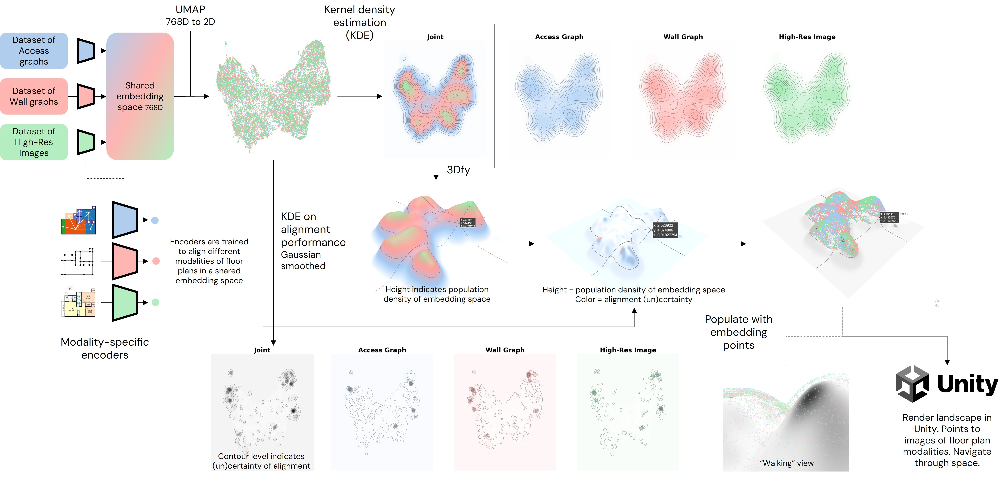
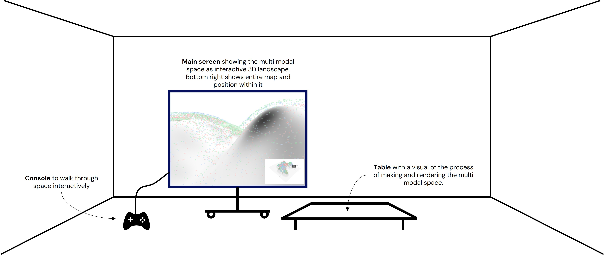

# The Space of Spaces

This project explores the decoding of interior spaces, specifically floor plans, to understand how machines perceive the organization of space.

## Concept
A standard approach for training multi-modal reasoning models involves encoding data from various modalities into a shared embedding space.
The goal of training such models is simple: embeddings from the same underlying content are learned to be positioned closely within the shared embedding space.
While this embedding space typically serves as an intermediate step for downstream applications, we are interested in exploring the intrinsic goodness of the shared space itself.
We investigate regions where the model exhibits more or less certainty regarding alignment and explore ways to visualize this multi-modal space.

## Visualizing multi modal (un)certainty and point density
To understand what the model places in close proximity, our core idea is to visualize alignment uncertainty overlaid on a projected embedding space.
The workflow is as follows:

- **Dimensionality reduction**: We apply UMAP on the entire multi-modal space, reducing it from 768D to 2D for all points simultaneously.
- **Topography**: The height of the resulting landscape is determined by point density using Kernel Density Estimation (KDE).
- **Uncertainty mapping**: To represent alignment uncertainty, we calculate a Gaussian-smoothed KDE based on ranking quality, specifically the average inter-modality rank of the top-1 prediction.
- **Heatmap projection**: This alignment uncertainty is then projected as a color heatmap directly onto the landscape defined by the point density.

The following figure shows the process of creating the landscape:

## Interactive setup
The physical realization of this concept consists of an interactive setup with two main components:

- **Process map**: A static map displayed on a table illustrates how the visual and interactive landscape is generated.
- **Interactive navigation**: A large screen allows users to navigate the landscape of the embedding space. As users walk through the space, floor plans derived from high-res images, graphs, and wall graphs are displayed at the exact locations where the model embedded them. Only modalities that are physically close to the user's current position in the space are shown.

The following figure shows intended setup
